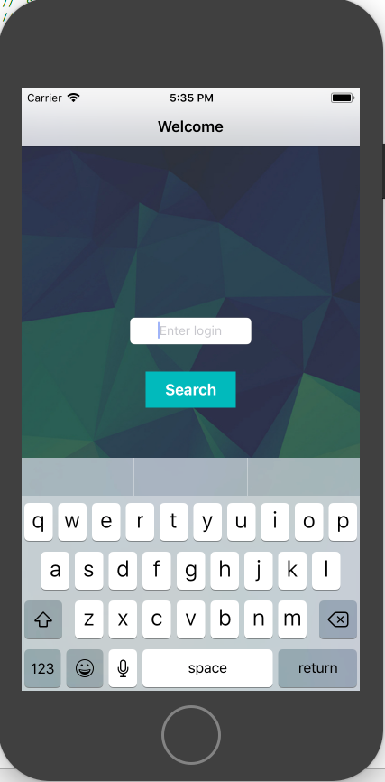
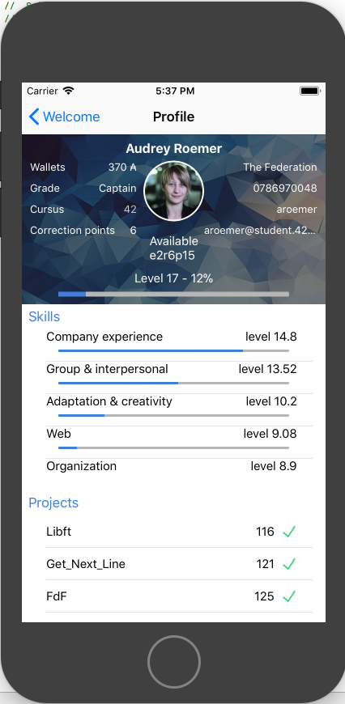

# Swifty-Companion
Ce projet a pour but de vous initier au développement d'application iOS. Il s'agit de réaliser, en Swift, une application qui permet de récupérer les informations des élèves de 42, en utilisant l’API de l'intranet de 42.

